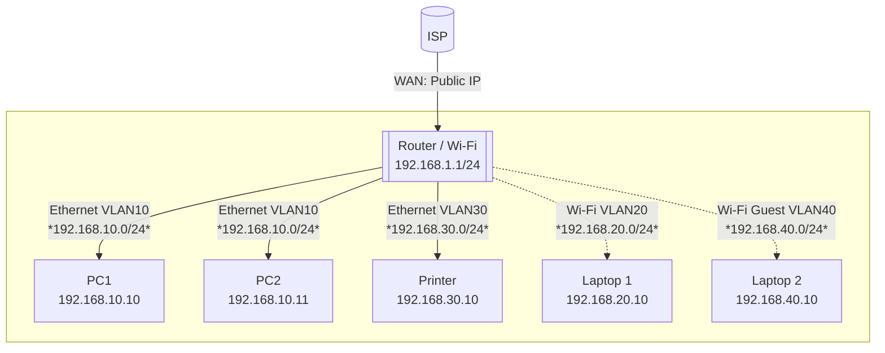
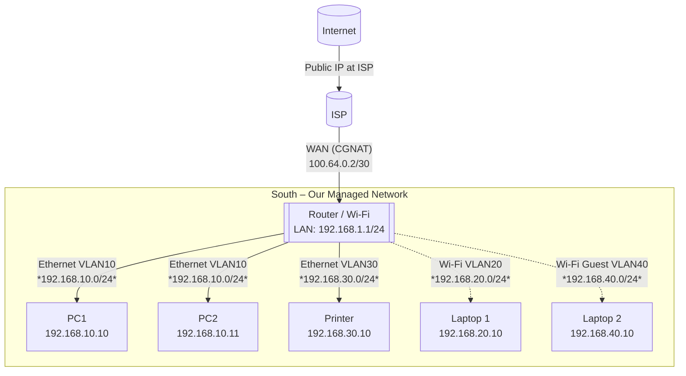

# Simple network example

```mermaid
graph TD;
  ISP[(ISP)]
  R[[Router / Wi-Fi<br/>192.168.1.1/24]]

  ISP -- WAN: Public IP --> R

  %% Wired clients
  PC1[PC1<br/>192.168.10.10]
  PC2[PC2<br/>192.168.10.11]
  PRN[Printer<br/>192.168.30.10]

  %% Wireless clients
  L1[Laptop 1<br/>192.168.20.10]
  L2[Laptop 2<br/>192.168.40.10]

  %% Connections 
  R -- Ethernet VLAN10
  *192.168.10.0/24* --> PC1
  R -- Ethernet VLAN10
  *192.168.10.0/24* --> PC2
  R -- Ethernet VLAN30
  *192.168.30.0/24* --> PRN
  R -. "Wi-Fi VLAN20
  *192.168.20.0/24*" .-> L1
  R -. "Wi-Fi Guest VLAN40
  *192.168.40.0/24*" .-> L2

  subgraph " "
    R
    PRN
    PC1
    PC2
    L1
    L2
  end
```

```mermaid
graph TD;
  NET[(Internet)]
  ISP[(ISP)]
  R[[Router / Wi-Fi<br/>LAN: 192.168.1.1/24]]

  NET -- Public IP at ISP --> ISP
  ISP -- "WAN (CGNAT)\n100.64.0.2/30" --> R

  %% Wired clients
  PC1[PC1<br/>192.168.10.10]
  PC2[PC2<br/>192.168.10.11]
  PRN[Printer<br/>192.168.30.10]

  %% Wireless clients
  L1[Laptop 1<br/>192.168.20.10]
  L2[Laptop 2<br/>192.168.40.10]

  %% Connections 
  R -- Ethernet VLAN10
  *192.168.10.0/24* --> PC1
  R -- Ethernet VLAN10
  *192.168.10.0/24* --> PC2
  R -- Ethernet VLAN30
  *192.168.30.0/24* --> PRN
  R -. "Wi-Fi VLAN20
  *192.168.20.0/24*" .-> L1
  R -. "Wi-Fi Guest VLAN40
  *192.168.40.0/24*" .-> L2

  subgraph "South – Our Managed Network"
    R
    PRN
    PC1
    PC2
    L1
    L2
  end

```
